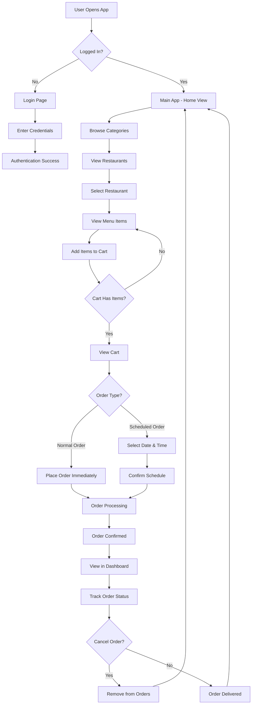
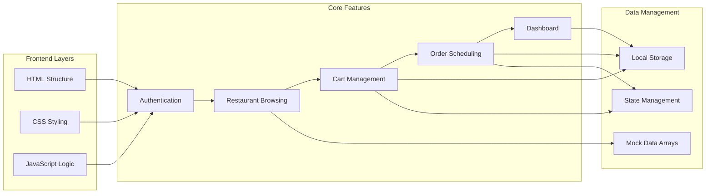
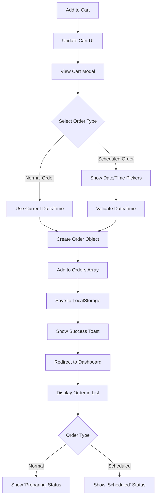
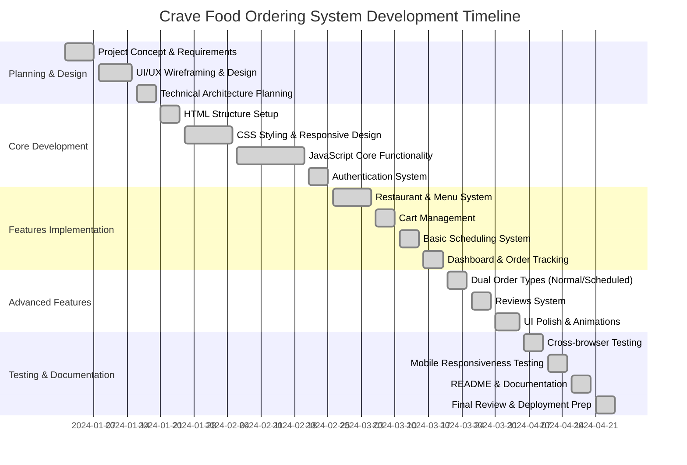
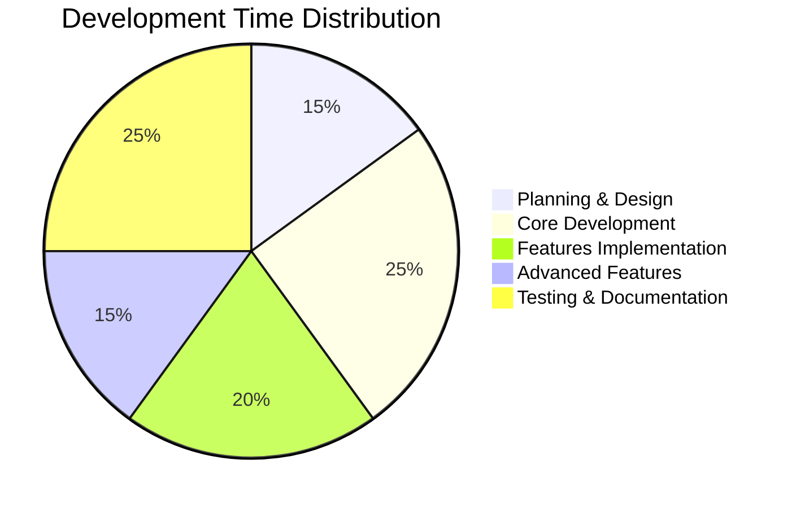

# 🍽️ Crave – Smart Food Pre-Ordering & Scheduling System

Crave is a modern web-based food ordering platform that revolutionizes convenience by allowing users to **schedule and pre-order meals in advance**. Inspired by platforms like Zomato and Swiggy, it focuses on **weekly meal planning**, smart scheduling, and a clean corporate UI experience.

---

## 🚀 Concept

> Plan your meals today. Eat stress-free tomorrow.

---

## 📊 Project Diagrams

### User Journey Flow Chart



### Application Architecture Flow



### Order Processing Flow



## 📅 Project Development Gantt Chart



### Development Phases Breakdown



---

## ✨ Features

### 🎨 Modern UI/UX
- Clean, minimalist corporate design
- Responsive layout optimized for mobile and desktop
- Real-world app-like interface with smooth animations

### 🔐 Multi-Page Routing
- `index.html` → Landing page with hero section
- `login.html` → Login portal with authentication simulation
- `app.html` → Main application (SPA-like behavior)

### 🍛 Rich Food Discovery
- 15+ mock restaurants with diverse cuisines
- 50+ dishes (Indian cuisine focused with international options)
- Smooth browsing experience with category filters
- Restaurant ratings and delivery time estimates

### ⭐ Dynamic Reviews System
- Expandable reviews for each dish
- Displays ★ Good and ★ Bad ratings with customer feedback
- Realistic customer reviews UI (Flipkart-style)

### 🛒 Dual Order Types (Core Feature)
- **Normal Order**: Immediate delivery for today
- **Scheduled Order**: Plan ahead for next week with date/time selection
- Smart cart scheduling with advance meal planning
- Real-time cart updates and quantity management

### 📊 Stateful Dashboard
- Uses `localStorage` for data persistence
- Features:
  - View all orders (normal and scheduled)
  - Cancel orders instantly
  - Order status tracking (Preparing/Scheduled)
  - Persistent data storage across sessions

### 🇮🇳 Indian Localization
- All prices in ₹ (INR)
- Localized UI and calculations
- Restaurant names and dishes in Indian context

---

## 🛠️ Tech Stack

- **HTML5** – Semantic structure and accessibility
- **CSS3** – Modern styling with:
  - Flexbox and Grid layouts
  - CSS Variables for theming
  - Smooth animations and transitions
  - Responsive design patterns
- **JavaScript (ES6+)** – Interactive functionality:
  - DOM manipulation and event handling
  - State management with localStorage
  - Route protection and authentication simulation
  - Dynamic content rendering
  - Form validation and user feedback

---

## ⚡ How to Run

No installation required. This is a pure frontend application.

### Prerequisites:
- Modern web browser (Chrome, Firefox, Safari, Edge)
- No server or dependencies needed

### Steps:
1. **Download or clone the repository:**
   ```bash
   git clone https://github.com/your-username/smart-pre-order-scheduling.git
   cd smart-pre-order-scheduling
   ```

2. **Open the project:**
   - Navigate to the project folder
   - Double-click `index.html` to start

3. **Explore the application:**
   - **Landing Page**: Browse featured content
   - **Login**: Use any credentials (simulated authentication)
   - **Browse Restaurants**: Explore different cuisines and restaurants
   - **Add to Cart**: Select items and choose order type
   - **Schedule Orders**: Pick date and time for advance planning
   - **Dashboard**: View and manage all your orders

---

## � Razorpay Test Setup (Backend)
If you want to use Razorpay payment flow, start the backend and configure test keys.

1. Open a terminal and go into the backend folder:
   ```bash
   cd backend
   ```
2. Copy the example env file:
   - On Windows:
     ```powershell
     copy .env.example .env
     ```
   - On macOS / Linux:
     ```bash
     cp .env.example .env
     ```
3. Edit `backend/.env` and set your Razorpay test keys:
   ```env
   RAZORPAY_KEY_ID=rzp_test_your_key_id
   RAZORPAY_KEY_SECRET=rzp_test_your_key_secret
   PORT=5000
   ```
4. Install dependencies and start the backend:
   ```bash
   npm install
   npm start
   ```
5. Open `app.html` in your browser and place an order using the checkout form.

> The backend will fail to start if the Razorpay test keys are missing or incorrect.

---

## �📂 Project Structure

```
Smart-Pre-Order-Scheduling-in-Food-Ordering-Systems-main/
│── index.html          # Landing page with hero section
│── login.html          # Authentication page
│── app.html           # Main application (SPA)
│── script.js          # JavaScript functionality
│── styles.css         # CSS styling and themes
│── README.md          # Project documentation
```

### File Descriptions:
- **`index.html`**: Entry point with marketing content and navigation
- **`login.html`**: User authentication interface (simulated)
- **`app.html`**: Core application with restaurant browsing, cart, and dashboard
- **`script.js`**: Handles all interactive features, state management, and UI logic
- **`styles.css`**: Complete styling system with responsive design

---

## 🎯 Usage Guide

### For Users:
1. **Start**: Open `index.html` in your browser
2. **Login**: Enter any username/password (demo mode)
3. **Browse**: Explore restaurants and cuisines
4. **Order**: Choose between Normal or Scheduled delivery
5. **Schedule**: For scheduled orders, select date and time
6. **Track**: View all orders in the dashboard

### For Developers:
- All code is in vanilla JavaScript (no frameworks)
- CSS uses modern features with fallbacks
- State persists in localStorage
- Easily customizable for different themes or features

---

## 🔧 Customization

### Adding New Restaurants:
Edit the `restaurants` array in `script.js`:

```javascript
{
    id: 'new_restaurant',
    name: 'New Restaurant Name',
    rating: '4.5',
    meta: 'Cuisine Type • Price Range',
    time: '30 min',
    heroImg: 'image_url',
    cardImg: 'image_url',
    menu: [
        // Add menu items
    ]
}
```

### Styling Changes:
- Modify CSS variables in `:root` for theme colors
- Update responsive breakpoints in media queries
- Customize animations and transitions

### Adding Features:
- Extend the `orders` data structure for new fields
- Add new functions to `script.js`
- Update HTML structure as needed

---

## 📱 Responsive Design

The application is fully responsive and works on:
- **Desktop**: Full feature set with grid layouts
- **Tablet**: Optimized touch interactions
- **Mobile**: Streamlined interface with collapsible menus

---

## 🌟 Key Highlights

- **Zero Dependencies**: Pure HTML/CSS/JS - no build tools needed
- **Offline Capable**: Works without internet (except for images)
- **Fast Loading**: Optimized for quick startup
- **Accessible**: Semantic HTML and keyboard navigation
- **Modern JavaScript**: ES6+ features with backward compatibility

---

## 🤝 Contributing

1. Fork the repository
2. Create a feature branch
3. Make your changes
4. Test thoroughly
5. Submit a pull request

---

## 📄 License

This project is open source and available under the [MIT License](LICENSE).

---

## 🙋 Support

For questions or issues:
- Open an issue on GitHub
- Check the browser console for errors
- Ensure you're using a modern browser

---

*Built with ❤️ for food lovers who plan ahead*
│── assets/
```

---

## 🎯 Key Learnings

- Vanilla JavaScript application building  
- SPA-like behavior without frameworks  
- LocalStorage-based persistence  
- UI/UX design principles  
- Client-side routing and authentication  

---

## 💡 Problem Solved

❌ Existing apps → Require ordering every time  
✅ GourmetSync → Allows **pre-planned weekly meal scheduling**

---

## 📌 Future Enhancements

- Backend integration (Node.js + Database)  
- Real authentication system  
- Payment gateway  
- Notifications for scheduled meals  
- AI-based recommendations  

---

## 👩‍💻 Author

**Sanskriti Gupta**  
B.Tech CSE Student  

---

## 📜 License

This project is created for educational purposes as part of a Web Technology course.
